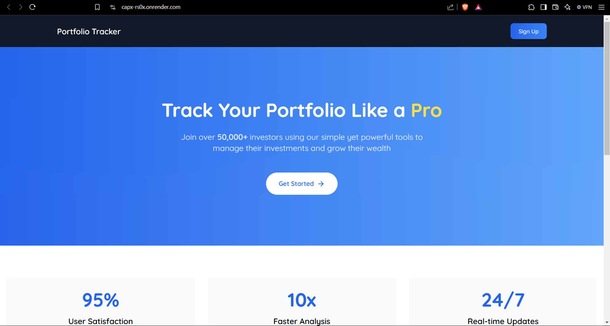
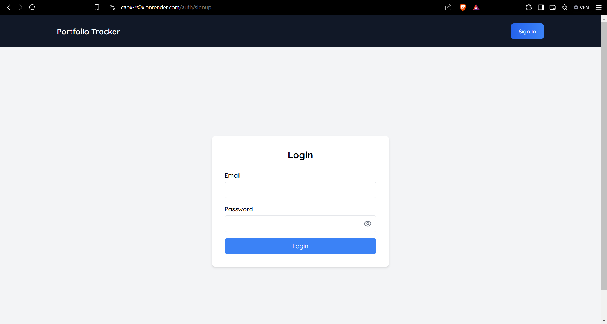
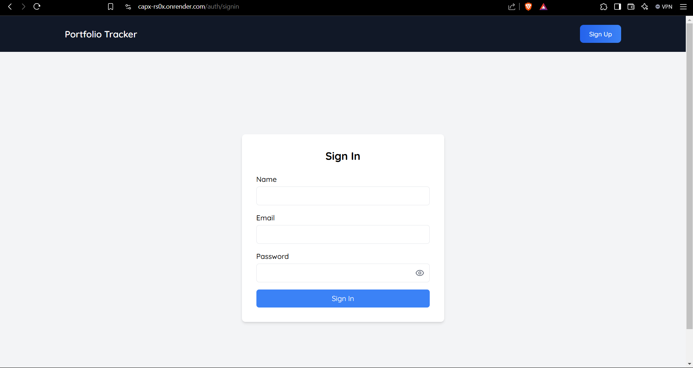
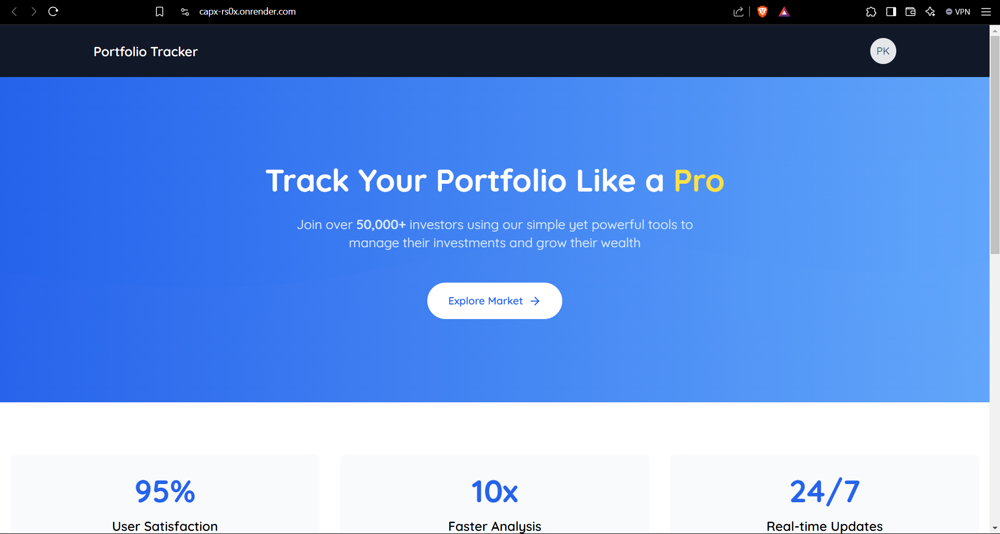
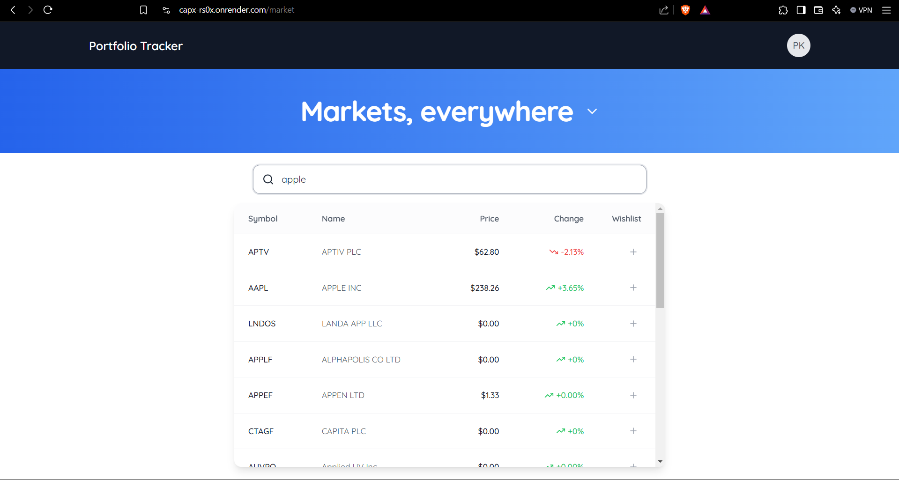
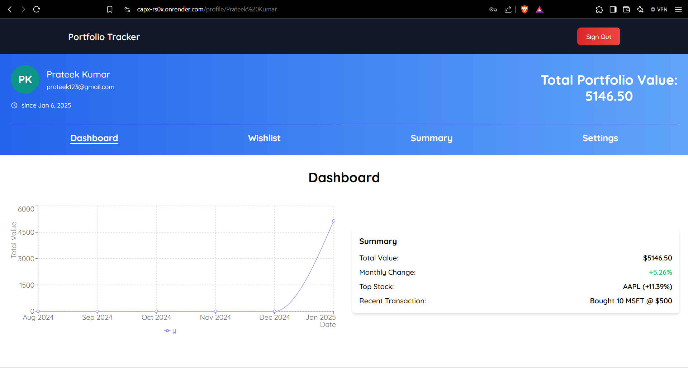
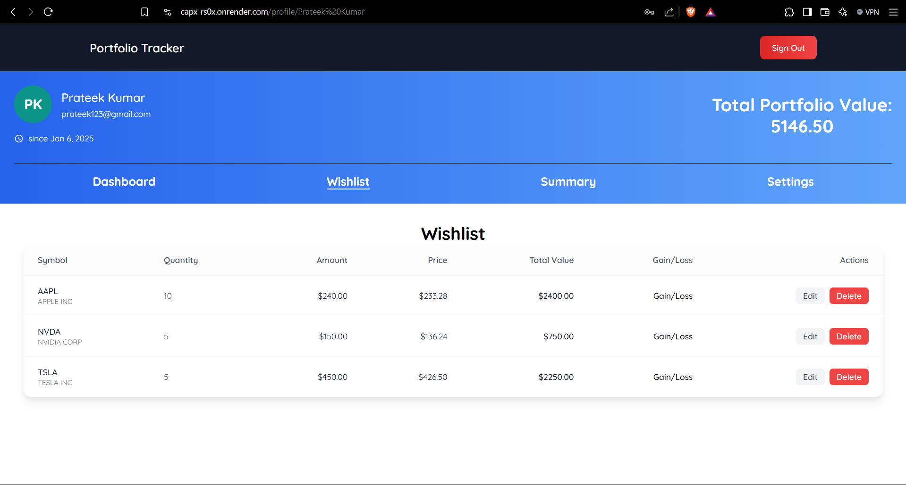
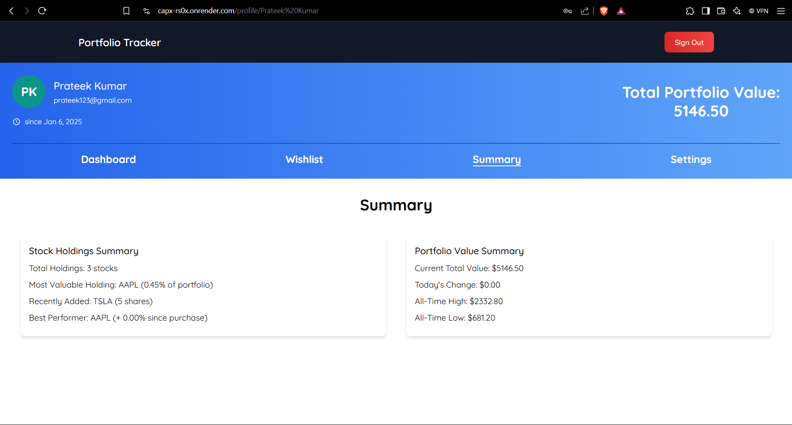
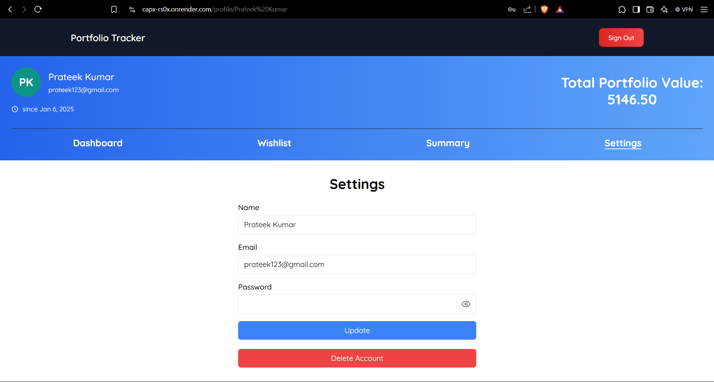

# Capx Portfolio Tracker


*Home Page of the application.*

This is a portfolio tracking application built with [Next.js](https://nextjs.org). It allows users to manage their stock portfolios, track real-time stock prices, and maintain a wishlist of stocks.

## Screenshots


*Sign In Page of the application.*


*Sign In Page of the application.*


*SignedIn Home Page of the application.*


*Market of the application.*


*Profile Dashboard Page of the application.*


*Profile Wishlist Page of the application.*


*Profile Summary Page of the application.*


*Profile Settings Page of the application.*

## Getting Started

### Prerequisites
- Node.js (version X.X.X or higher)
- npm (or yarn, pnpm, bun)

### Installation
1. Clone the repository:
   ```bash
   git clone https://github.com/pratee-k-umar/PortfolioT.git
   cd app
   ```
2. Install dependencies:
   ```bash
   npm install
   # or
   yarn install
   # or
   pnpm install
   ```

First, run the development server:

```bash
npm run dev
# or
yarn dev
# or
pnpm dev
# or
bun dev
```

Open [http://localhost:3000](http://localhost:3000) with your browser to see the result.

You can start editing the page by modifying `app/page.js`. The page auto-updates as you edit the file.

This project uses [`next/font`](https://nextjs.org/docs/app/building-your-application/optimizing/fonts) to automatically optimize and load [Geist](https://vercel.com/font), a new font family for Vercel.

## Features

- User authentication with NextAuth.js
- Real-time stock price updates using WebSockets
- Portfolio value tracking and visualization
- Wishlist management for stocks
- Responsive design

## Usage
To use the application:
1. Register for an account.
2. Log in to access your portfolio.
3. Add stocks to your portfolio and wishlist.

## Contributing
Contributions are welcome! Please submit issues and pull requests to help improve the project.

## Deployment on Render

The Capx Portfolio Tracker is deployed on Render. You can access the live application at [https://capx-rs0x.onrender.com](https://capx-rs0x.onrender.com).

This deployment includes all the features of the application, allowing users to manage their stock portfolios and track real-time stock prices.

## Learn More

To learn more about Next.js, take a look at the following resources:

- [Next.js Documentation](https://nextjs.org/docs) - learn about Next.js features and API.
- [Learn Next.js](https://nextjs.org/learn) - an interactive Next.js tutorial.

You can check out [the Next.js GitHub repository](https://github.com/vercel/next.js) - your feedback and contributions are welcome!

## License
This project is licensed under the MIT License - see the [LICENSE](LICENSE) file for details.
